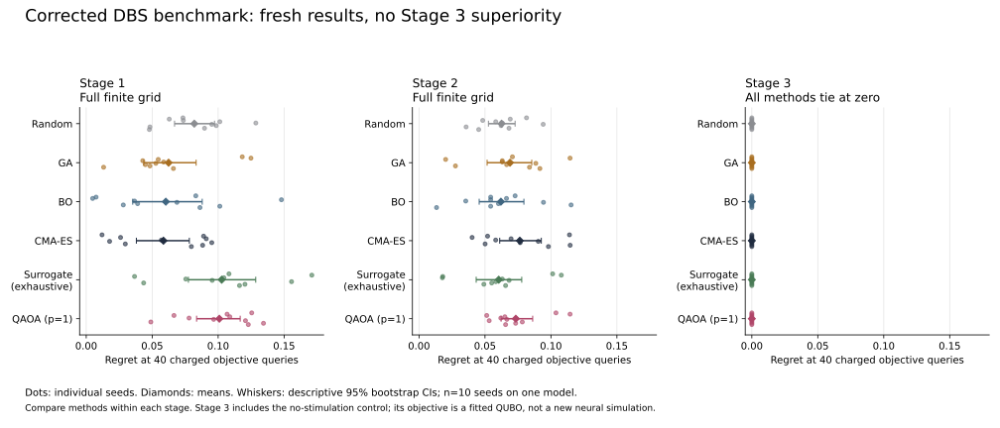

# Quantum-assisted Optimization of Parkinson's DBS Parameters

**A ground-truth benchmark for optimization under constrained trial budgets.**

This collaborative project compares classical and quantum-assisted optimizers
on a simplified STN–GPe simulation and proxy objectives. It is not a clinical
tool, patient treatment recommendation, or clinical validation.

**The corrected benchmark does not support the historical Stage 3 QAOA
superiority claim.** The unchanged Stage 3 objective is minimized by no
stimulation. With that shared control, every method has zero regret. A
nonempty-domain sensitivity also fails to establish QAOA superiority.



At 40 charged objective queries, ten paired optimizer seeds on one model:

| Stage | Lowest observed mean regret ± sample SD | QAOA p=1 mean ± sample SD |
|---|---|---|
| 1: three-parameter grid | CMA-ES: 0.058542 ± 0.033961 | 0.100912 ± 0.028124 |
| 2: mode and charge-density constraint | Exhaustive surrogate: 0.060433 ± 0.029445 | 0.073358 ± 0.020653 |
| 3: contact bits, zero allowed | All six methods: 0 ± 0 | 0 ± 0 |

These are fresh corrected runs, not historical notebook output. Compare methods
within each stage; objectives differ. [All budgets, confidence intervals and
sensitivity results](results/RESULTS.md) retain the uncertainty and limitations.

## Start here

- [Portfolio handoff](docs/PORTFOLIO_HANDOFF.md): research story, corrected results, assets.
- [Claim ledger](docs/PORTFOLIO_CLAIM_LEDGER.md): what can and cannot be said publicly.
- [Portfolio copy](docs/PORTFOLIO_COPY_FINAL.md): bounded website wording.
- [Protocol](docs/CORRECTED_PROTOCOL.md): domains, initialization, resources and assumptions.
- [Source audit](docs/SOURCE_AUDIT.md) and [paper revision requirements](docs/PAPER_REVISION.md).
- [Contribution verification](docs/COLLABORATION_TODO.md): individual historical roles remain unresolved.

## Reproduce

Use Python 3.12 and an isolated environment, from the repository root:

```bash
python3.12 -m venv .venv
source .venv/bin/activate
python -m pip install -r requirements-lock.txt
python -m unittest discover -s tests -v
```

Small command (smoke grids; not portfolio result evidence):

```bash
python -m dbs_benchmark.cli --config configs/smoke.json --output results/smoke
```

Full benchmark on the original finite domains, with fresh simulation:

```bash
python -m dbs_benchmark.cli --config configs/benchmark.json --output results/current
```

The sensitivity experiment and figure/table generation:

```bash
python -m dbs_benchmark.cli --config configs/nonempty.json --output results/nonempty
python scripts/report.py
python scripts/architecture.py
```

`--oracle-only` builds fresh oracles without optimizer runs. `--reuse-oracles`
requires matching model-source/config hashes and verifies the saved artifact
hash; it never accepts notebook output. Versions, source hashes, config and
per-run traces are saved. The recorded environment is Python 3.12.14 on macOS
arm64; small floating-point differences across platforms are possible.

## What the budget counts

Budgets count unique scalar **objective queries**, including shared initialization.
Stages 1/2 replay a simulator-backed grid; Stage 3 evaluates a fitted QUBO.
Exhaustive simulator setup and ground-truth construction are outside the budget.
QAOA uses a classical statevector simulator, seeded finite-shot sampling and
classical COBYLA. Its internal circuits and shots are separate resources:
[resource rows](results/resources.csv). Equal query budgets are not equal
computational cost, hardware speedup, or patient trials.

## Repository layout

| Location | Role |
|---|---|
| `dbs_benchmark/` | Maintained simulator, objectives, optimizers and CLI |
| `configs/` | Primary, nonempty sensitivity and smoke protocols |
| `tests/` | Original audit and corrected implementation checks |
| `results/current/` | Fresh oracles, source/config manifests, per-seed traces |
| `results/nonempty/` | Separate Stage 3 sensitivity |
| `results/*.csv` | Results, paired comparisons and resources |
| `scripts/`, `assets/` | Validation and reproducible SVG/PNG figures |
| `docs/` | Handoff, claims, assumptions and revision notes |
| `paper/` | Historical March manuscript, superseded for results |
| `audit/`, `historical/`, `stage*.ipynb` | Preserved historical sources; not the maintained entry point |

The fresh pipeline preserves scientific objectives while repairing domains,
QUBO cost phases, budgets, seeding and the misleading exact label. It specifies
a common initial design and current algorithm variants. The original notebooks
remain unchanged. The [historical manuscript](paper/HISTORICAL_2026-03_DBS_Manuscript.pdf)
**requires revision**; its tables and figures must not be reused as corrected evidence.

The original project was collaborative. Uploads under Esther's account do not
establish sole authorship. Current corrections, tests, reruns and the handoff
were produced with Codex assistance at Xin's request. No independent scientific
peer review is claimed.
