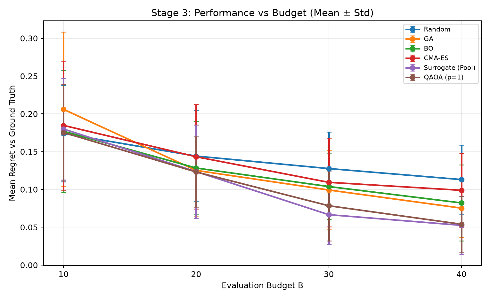

# Controlled Stage 3 rerun — six-contact efficacy domain

**QAOA is competitive, but is not demonstrably better than the leading classical comparator. The previous 75–80% advantage does not survive this controlled rerun.**

## A. Restoration

The working branch is `research/stage3-six-contact-baseline`, created directly from original commit `b5e2468320d437bce5ddec8025ba409e5a26dc5b`. That baseline contains only the original README and three stage notebooks. Stage 3 was originally uploaded at `b0a1ac9`; the latest pre-repair baseline `b5e2468` preserves it.

The recent broad audit/replacement pipeline had added 63 changed/new files: reusable benchmark modules, audit helpers, configs, tests, portfolio documents, saved results/figures, a historical-paper copy and CI. Those additions are excluded from this branch, rather than destructively removed from history. Prior work remains on `research/corrected-portfolio` and the local provenance/review branches. Previous generated smoke/PDF-inspection files were preserved outside the working repository under `../deliverables/dbs-portfolio/support/pre-restoration-untracked/`.

`README.md`, `stage1.ipynb` and `stage2.ipynb` are byte-identical to the baseline. Stage 3's simulator, beta-power calculation, quadratic fit and contact metadata source cells are identical. Its `build_Q` and `qubo_value` functions and all six optimizer function signatures/defaults are unchanged. No manuscript was edited.

## B. Corrected feasible domain

The sole scientific correction is the intersection:

```text
sum(x) == 6
BetaRatio(x) = c0 + c1*A_eff + c2*A_eff² <= 0.8228585
A_eff = 0.25 * sum(FOCUS[i] * x[i])
```

BetaRatio is the **original Stage 3 fitted proxy, including its intercept**, not a newly substituted direct-simulation objective. The supplied threshold agrees with the saved Stage 2 beta-ratio target after rounding. These are the user-specified benchmark admissibility rules; this does not establish clinical validation.

| Enumeration result | Computed count |
|---|---:|
| All binary masks | 65,536 |
| Exactly six active contacts | 8,008 |
| Exactly six and fitted BetaRatio ≤ 0.8228585 | 6,881 |
| Full binary space remaining | 10.499573% |

Every method and the ground-truth oracle use this identical set. Infeasible masks have infinite oracle cost and are rejected before objective scoring. Random, GA, BO and CMA-ES retain their original proposal mechanisms with feasibility rejection. The surrogate candidate pool and QAOA initialization/fallback sample only admissible masks. QAOA's existing internal rejection barrier also rejects infeasible sampled masks, and its final decoding has a mandatory hard feasibility filter. A low internal circuit/surrogate energy cannot grant an infeasible mask a benchmark score. No extra objective penalty or clinical constraint was added.

The original `Surrogate (Exact)` implementation samples 5,000 random candidates. It is retained and accurately labeled **Surrogate (Pool)** for this one-correction scope; a genuinely exact surrogate optimizer was not added. Brute-force **ground truth** is exact over all admissible masks.

## C. Ground truth

- Unique optimal feasible mask: **38180** (integer; bit i means contact i).
- Binary, most-significant bit first: `1001010100100100`.
- Active contacts, **zero-based**: **[2, 5, 8, 10, 12, 15]**.
- Effective amplitude: **1.570000000000**.
- Fitted BetaRatio: **0.818797501824**.
- Total original Stage 3 cost: **1.569039471470**.

| Existing objective term | Contribution |
|---|---:|
| efficacy_without_constant_c0 | -0.124960528530 |
| count | 1.080000000000 |
| energy | 0.093250000000 |
| risk | 0.154000000000 |
| overlap | 0.366750000000 |
| charge_density | 0.000000000000 |
| **Total** | **1.569039471470** |

The efficacy cost is `BetaRatio − c0`, because the original objective drops the constant `c0 = 0.943758030354`. This convention is preserved. The count/sparsity term is now constant at `6 × 0.18 = 1.08`; it was not deleted or retuned. Charge-density terms remain as originally implemented.

The coefficients were freshly fitted using the unchanged simulator: `[0.9437580303537102, -0.11458817038088676, 0.022290112770454024]`. This required 42 simulator calls including baseline. The exact optimum is unique; the nearest exactly-six BetaRatio to the threshold differs by approximately `1.19169e-5`, so membership is not resting on a rounding tie.

## D. Optimizer results

Original structure retained: budgets **10, 20, 30, 40**, **30 repetitions** per method/budget (seeds 0–29), six original methods, original per-method initialization rules, and `regret = best observed cost − feasible ground-truth cost`. Each budget is a separate original-style run, not a prefix extracted from B=40. Original QAOA settings remain p=1, 256 internal shots, at most 30 COBYLA iterations, and 1,024 final proposal shots. No optimizer hyperparameters were tuned.

Below is **mean regret ± population standard deviation**, using the original `numpy.std(..., ddof=0)` convention:

| Method | B=10 | B=20 | B=30 | B=40 |
|---|---:|---:|---:|---:|
| Random | 0.174012 ± 0.063906 | 0.144140 ± 0.060162 | 0.127619 ± 0.048665 | 0.113079 ± 0.045784 |
| GA | 0.205983 ± 0.102295 | 0.125186 ± 0.060365 | 0.099263 ± 0.052292 | 0.075283 ± 0.038768 |
| BO | 0.177022 ± 0.080698 | 0.128352 ± 0.061696 | 0.103829 ± 0.043677 | 0.082164 ± 0.050326 |
| CMA-ES | 0.184742 ± 0.085346 | 0.143246 ± 0.069175 | 0.109434 ± 0.058656 | 0.098881 ± 0.048787 |
| Surrogate (Pool) | 0.179932 ± 0.067134 | 0.123577 ± 0.061877 | 0.066622 ± 0.039385 | 0.052564 ± 0.038273 |
| QAOA (p=1) | 0.175319 ± 0.063894 | 0.123154 ± 0.046433 | 0.078434 ± 0.046248 | 0.053987 ± 0.036828 |

All **720/720 runs** completed their budgets. All **18,000/18,000 recorded observations** were distinct within their run and admissible. Each method at each budget had **30/30 feasible completed runs (100%)**. This is not the raw proposal acceptance rate: infeasible internal proposals are rejected without becoming scored objective queries. Mean final cost is also retained in [summary.csv](results/stage3_controlled/summary.csv).

Best and median regret summarize the saved seed distributions (the original analysis included boxplots):

| Budget | Method | Best seed regret | Median regret | Feasible completed runs |
|---|---|---:|---:|---:|
| 10 | Random | 0.062073 | 0.160921 | 30/30 |
| 10 | GA | 0.005446 | 0.196393 | 30/30 |
| 10 | BO | 0.053667 | 0.160404 | 30/30 |
| 10 | CMA-ES | 0.046500 | 0.166590 | 30/30 |
| 10 | Surrogate (Pool) | 0.062073 | 0.171158 | 30/30 |
| 10 | QAOA (p=1) | 0.062073 | 0.164714 | 30/30 |
| 20 | Random | 0.042048 | 0.130068 | 30/30 |
| 20 | GA | 0.045500 | 0.112394 | 30/30 |
| 20 | BO | 0.008167 | 0.112870 | 30/30 |
| 20 | CMA-ES | 0.005446 | 0.134344 | 30/30 |
| 20 | Surrogate (Pool) | 0.012126 | 0.131574 | 30/30 |
| 20 | QAOA (p=1) | 0.000000 | 0.127618 | 30/30 |
| 30 | Random | 0.041548 | 0.127599 | 30/30 |
| 30 | GA | 0.000000 | 0.089823 | 30/30 |
| 30 | BO | 0.005446 | 0.101467 | 30/30 |
| 30 | CMA-ES | 0.001000 | 0.103012 | 30/30 |
| 30 | Surrogate (Pool) | 0.001000 | 0.070286 | 30/30 |
| 30 | QAOA (p=1) | 0.000000 | 0.084112 | 30/30 |
| 40 | Random | 0.014026 | 0.118958 | 30/30 |
| 40 | GA | 0.005446 | 0.069600 | 30/30 |
| 40 | BO | 0.005446 | 0.072012 | 30/30 |
| 40 | CMA-ES | 0.001000 | 0.099026 | 30/30 |
| 40 | Surrogate (Pool) | 0.000000 | 0.048311 | 30/30 |
| 40 | QAOA (p=1) | 0.000000 | 0.055337 | 30/30 |



## E. Ranking

Descriptive order by sample mean regret; these ranks do not by themselves establish statistical separation:

| Budget | 1st | 2nd | 3rd | 4th | 5th | 6th |
|---|---|---|---|---|---|---|
| 10 | Random | QAOA (p=1) | BO | Surrogate (Pool) | CMA-ES | GA |
| 20 | QAOA (p=1) | Surrogate (Pool) | GA | BO | CMA-ES | Random |
| 30 | Surrogate (Pool) | QAOA (p=1) | GA | BO | CMA-ES | Random |
| 40 | Surrogate (Pool) | QAOA (p=1) | GA | BO | CMA-ES | Random |


## F. QAOA assessment

**Does QAOA outperform classical methods?** Some comparisons favor it, but there is no general classical-method lead. At B=10 it ranks second and no comparison is significant. At B=20 it has the lowest sample mean, only 0.000423 below the surrogate pool, with no significant comparison. At B=30 and B=40 it ranks second behind the surrogate pool.

Using the **original two-sided Mann–Whitney U test with Holm correction across five QAOA comparisons within each budget**:

| Budget | QAOA comparisons surviving Holm correction |
|---|---|
| 10 | None |
| 20 | None |
| 30 | Lower regret than Random only (raw p = 0.000398364) |
| 40 | Lower regret than Random (raw p = 0.00000472723) and CMA-ES (raw p = 0.000282779) |

QAOA is not statistically separated from Surrogate (Pool) at any budget (raw p values 0.8302, 0.9117, 0.3218, 0.9528). This supports **competitive / statistically indistinguishable in this test**, not proven equivalence. Comparisons against BO and GA do not survive the original Holm correction. Complete test statistics are in [qaoa_statistics.csv](results/stage3_controlled/qaoa_statistics.csv).

**Does the 75–80% advantage survive? No.** Relative to the surrogate pool's mean regret, QAOA is 2.56% lower at B=10, 0.34% lower at B=20, **17.73% higher** at B=30 and **2.71% higher** at B=40. The strongest B=40 percentage reductions among the reported comparators are 52.26% versus Random and 45.40% versus CMA-ES, not 75–80% over the leading classical method.

**Does correcting zero contacts materially change the conclusion? Yes.** The unconstrained zero-mask optimum is removed by the specified domain. A nontrivial feasible optimum and positive regrets replace it. The preserved QAOA implementation is competitive with the leading surrogate method, but the original broad superiority headline is not supported.

### Interpretation limits retained with the controlled baseline

- This is one simulation/proxy instance. Optimizer seeds are not patient variation. “Admissible” here means satisfying the two specified rules, not demonstrated clinical safety or efficacy.
- To honor the requested scope, the historical QAOA cost-circuit construction was preserved. Its previously flagged binary-QUBO-to-Ising mapping issue is **not corrected by this domain-only experiment**. These results characterize that preserved implementation, not a separately validated ideal-QAOA algorithm.
- The original comparator remains a random candidate-pool surrogate search, not an exact surrogate solve. The present comparison does not support an exact-solver superiority claim.
- Budgets count unique admissible Stage 3 QUBO objective queries, including each method's initialization. Offline simulator fitting, full-domain ground truth, feasibility lookup, surrogate predictions, internal circuit shots and rejected proposals are outside B. Equal B is not equal computing resources or neural-simulation calls.
- The original notebook did not pin its environment and its metadata says Python 3.9.15. This rerun records Python 3.12.14 and pinned installed versions; historical stochastic traces cannot be reconstructed exactly.

## G. Artifacts and reproduction

Research source changed: **`stage3.ipynb` only**. Added execution support: **`run_stage3.py`** and **`requirements-stage3.txt`**. The notebook's stale outputs were cleared; current outputs are saved separately. Stage 1, Stage 2, README, simulator and beta-power source remain unchanged.

Necessary execution details are explicit: Aer sampling is seeded by the recorded seed; CMA's special nondeterministic seed 0 maps to fixed seed 2147483647 while run labels remain 0–29; a final partial CMA batch cannot read uncharged objective values; GA cannot read an uncharged new cost after budget exhaustion. Aer uses one internal CPU thread per worker. A runner-only Matplotlib keyword compatibility adjustment exports the unchanged B=30 boxplot. These are execution/accounting changes, not objective or optimizer-hyperparameter tuning.

Generated under `results/stage3_controlled/`:

- `domain.json`: counts, unique optimum and objective decomposition.
- `oracle.npz`: all 65,536 mask IDs, active counts, fitted BetaRatios, admissibility and masked costs.
- `fit.npz`: fresh simulator fit samples, coefficients and original Q.
- `manifest.json`: actual experiment commit, source hashes and environment.
- `runs.jsonl`: all 720 runs and 18,000 charged observations.
- `validation.json`: domain/budget/completeness checks.
- `scope_checks.json`: preserved-source checks and pilot trace repeatability.
- `summary.csv`: original mean final cost, mean regret, population SD and N.
- `distribution.csv`: best/median regret and feasible completed-run rate.
- `ranking.csv`: mean-regret order within each budget.
- `qaoa_statistics.csv`: original Mann–Whitney/Holm analysis.
- `regret_vs_budget.png` / `.svg`: original mean ± SD comparison.
- `regret_distribution_B30.png` / `.svg`: original B=30 boxplot.

The experiment executed from local source commit `e8c7eaa208203bfd3708f163edf64977fff8e326`. Published engine commit `6c5d58ea45fb2327cf88cf87af59464df8e73bb2` has the identical source tree `4532892334bfd38fe7eed51f3aec8ff2310a31b2`. The later runner update only repairs plot export and adds saved-record reporting. Stage 3 source is unchanged from the executed experiment. A twelve-run pilot repeated the same seed-0/1 observations exactly with four workers versus the full sweep's 25.

From this repository checkout, use an isolated environment:

```bash
python3.12 -m venv .venv-stage3
source .venv-stage3/bin/activate
python -m pip install -r requirements-stage3.txt
```

Validate the complete domain without optimizer runs:

```bash
python run_stage3.py --validate-only --output results/stage3_validation
```

Reproduce the full original-size Stage 3 comparison:

```bash
python run_stage3.py --jobs 25 --output results/stage3_controlled
```

Validate saved observations and regenerate tables/plots without rerunning optimizers:

```bash
python run_stage3.py --report-only --output results/stage3_controlled
```

Worker count may be reduced for another computer; it changes execution concurrency, not algorithm settings. This report completes the requested Stage 3 rerun. **No research-paper editing was performed.**
