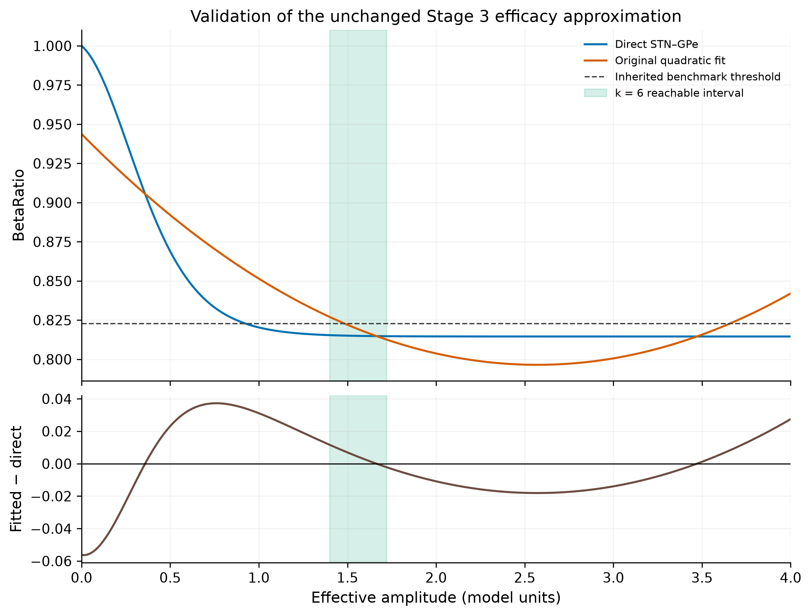
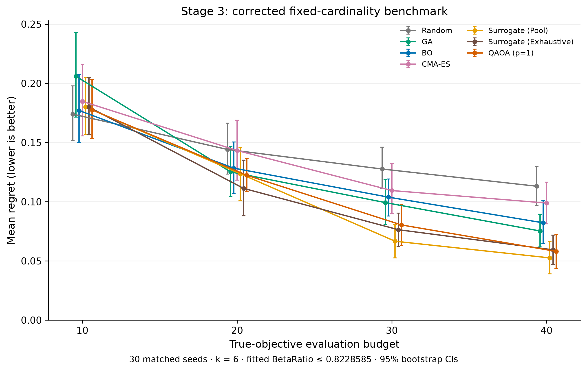
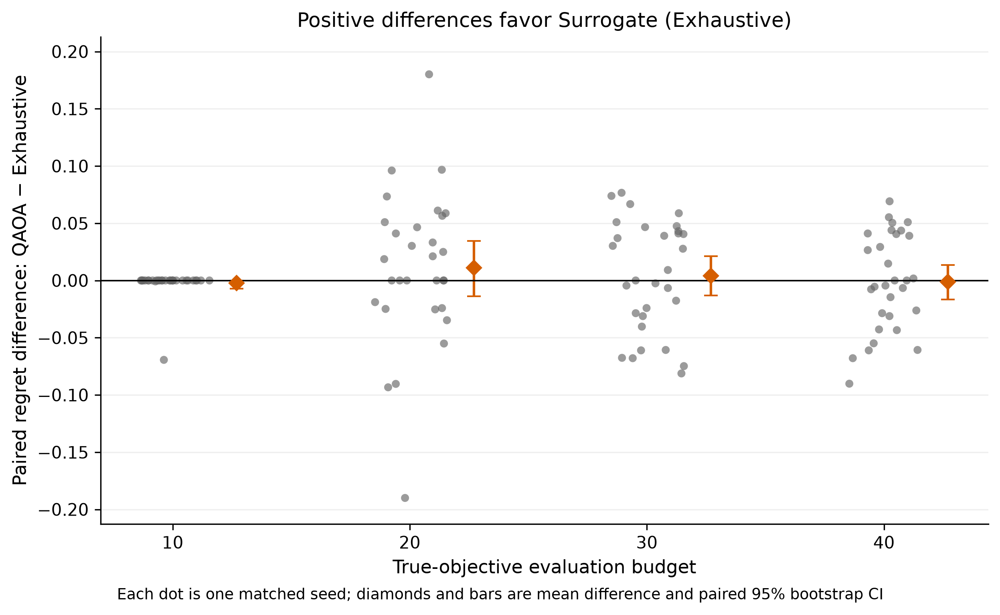
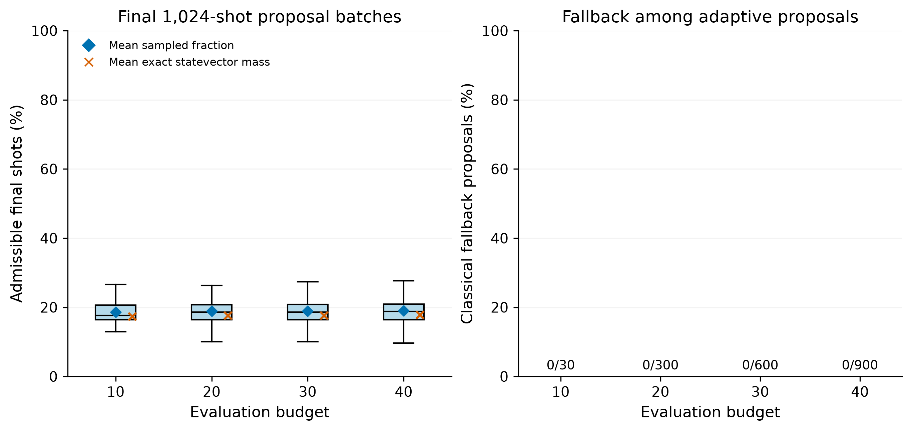
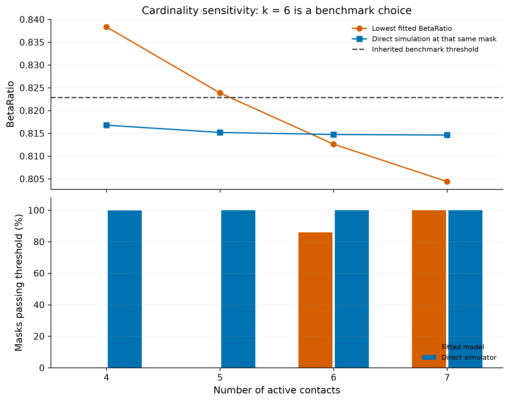

# Stage 3 Methodological Validation Report

Controlled parent: `b43e30bdccba85767f3a8835ab30e313a60b9977`. Branch: `research/stage3-methodology-validation`.

Primary execution source: local commit `9eb5a6e0d4bb97b7d69ca79a1b8a1d84468948e2`, published as commit `8ac127c6e2ff4c0a994929a272b693c39c410171` with the **identical Git tree** `c486f949ae12297cca792f7f5b59871fbc92375f`. The final delivery adds evidence, this report and a figure-marker visibility correction. Source fingerprints and execution configuration are saved with the data. No manuscript was edited.

## A. Executive summary

The binary surrogate coefficients were incorrectly used directly as Ising rotation coefficients. That mapping is now corrected and passes exhaustive energy and actual-circuit validation. A genuinely exhaustive classical surrogate comparator was added; the historical 5,000-draw pool remains intact. The three surrogate methods share exactly the same initial true observations for each budget/seed. QAOA proposal provenance, raw final counts and internal parameter-search diagnostics are recorded.

**No defensible quantum superiority is demonstrated.** Corrected QAOA is competitive with the two surrogate baselines, but it is not statistically separated from Surrogate (Exhaustive) at any budget after the principal four-budget Holm correction. It does not have the lowest mean regret at any budget. The previous 75–80% advantage claim does not survive. Correcting the mapping does not restore that claim.

**No classical fallback was used:** all 1,830 adaptive QAOA proposals came from QAOA samples. Classical surrogate fitting, parameter optimization, feasibility filtering and selection still contribute to this hybrid method. Proposal origin is measured; the isolated causal contribution of quantum evolution is not established by this experiment.

**Six contacts are a benchmark design choice, not a clinical necessity.** Direct STN–GPe validation accepts all five-contact masks and 1,817 of 1,820 four-contact masks under the inherited efficacy threshold, while the fitted model rejects both groups. The efficacy approximation misclassifies 1,127 of 8,008 six-contact masks. This materially weakens any physiological justification for the fitted admissibility boundary.

The simulator, beta-power calculation, Stage 1, Stage 2, threshold, Stage 3 weights and metadata, fitted efficacy formula, objective/regret, p=1, X mixer, angles/COBYLA procedure, shots, classical optimizer definitions, 30 seeds and budgets were preserved. All **600 unchanged classical runs reproduce every observation in the controlled delivery exactly**. All 21,000 selected true-objective observations in the new primary comparison are admissible. Previous controlled results remain byte-identical.

## B. Code changes

The initial status was clean at the pinned commit; `starting_state.json` records this and hashes of 21 preserved files. No restoration or history rewriting was needed in this task. Changes are confined to Stage 3 validation.

| File / function | Old behavior | New behavior | Scientific reason |
|---|---|---|---|
| `stage3.ipynb`, cell 7, `run_surrogate_qaoa.build_qaoa` | Binary linear/pair coefficients used directly in Z/ZZ rotations | Transform the complete fitted binary surrogate into Ising coefficients; use RZ(2γh), RZZ(2γJ) | Correct signs, factors and pair contributions to local fields |
| `stage3.ipynb`, cell 7, QAOA `fit_surrogate` | Nested quadratic ridge fit | Delegate to the numerically identical shared fit; same intercept, feature order and ridge | Keep QAOA and Exhaustive surrogate construction identical |
| `stage3.ipynb`, cell 7, `run_surrogate_exhaustive` (added) | Only random surrogate-pool comparator existed | Predict all unseen admissible masks after each refit, select the minimum, lowest integer on exact ties | Provide a full feasible-domain classical surrogate comparator |
| `stage3.ipynb`, cell 7, `run_surrogate_qaoa`, `sampler_probs`, `expected_cost` | No proposal-source or sample-feasibility record | Optional trace, counts, internal circuit history, exact mass and same-history exhaustive diagnostic | Attribute selected proposals and separate shots/computation from true evaluations |
| `stage3.ipynb`, cells 8–9 | Six-method run list / summary order | Add Surrogate (Exhaustive) as seventh method | Include the requested comparator; no classical method definition changes |
| `stage3_validation_core.py` (added) | No shared validation helpers | Binary/Ising energy conversion, cost layer, identical ridge fit, exhaustive proposal, bit/count diagnostics | Test the mapping independently and minimize duplicated mathematics |
| `validate_stage3.py` (added) | Controlled runner only | Bounded mapping/model/benchmark CLI, scope checks, cache and raw exports | Reproduce this validation without overwriting controlled results |
| `stage3_validation_analysis.py` (added) | Historical unpaired summaries | Paired randomization, bootstrap/Holm, complete descriptive statistics, five figures, saved-data acceptance checks | Analyze matched experiments and expose uncertainty/attribution |
| `test_stage3_validation.py` (added) | No tests for these new corrections | Six targeted tests, including full-space conversion, shared-fit identity, ties, matched starts, instrumentation neutrality, forced fallback | Check consequential behavior and an otherwise unexercised fallback path |

The Pool function's AST is unchanged. Notebook cells 0–6 are source-identical to the controlled parent. Stage 1/2, README, requirements, the old runner, the old report and every controlled result are byte-identical. No files were removed. The manuscript is outside the edited files and was not touched.

### Starting implementation and what remained frozen

The Stage 3 objective is an upper-triangular binary QUBO: diagonal entries are linear coefficients, upper-triangle entries are pair coefficients, and the constant fitted c0 is omitted from the cost. The surrogate has 137 features (intercept + 16 linear + 120 pairs), primal ridge 0.001, including intercept regularization. Only 9 initial observations are used at B=10; other budgets start with 10. The original seeded rejection sampling creates these observations.

Historical Pool makes 5,000 random admissible draws per adaptive step, skips seen masks and picks the smallest predicted objective. Draws can duplicate masks, so this is neither 5,000 guaranteed unique candidates nor exhaustive minimization. Its old internal function name `run_surrogate_exact` is retained for compatibility; the public comparator label is **Surrogate (Pool)**.

QAOA uses 16 qubits, Hadamard initialization, p=1, all 120 pair interactions, and independent Rx(2β) mixers. Gamma and beta start uniformly in [0, π] using the original seeded RNG. COBYLA uses at most 30 objective evaluations and 256 shots per call. Final sampling uses 1,024 shots. The minimum surrogate prediction among sampled unseen admissible masks is selected. If none exists, the original 5,000-draw classical admissible pool is used. No angles, shots, penalty strength or hyperparameters were tuned after observing outcomes.

Effective amplitude is `A_eff = 0.25 * sum(FOCUS[i] * x[i])`. Fixed settings are 130 Hz and 240 μs. The original simulator is evaluated at 41 amplitudes from 0 to 4 and normalized by its no-stimulation beta baseline. The unchanged quadratic least-squares expression is:

`BetaRatio_fit(A) = 0.9437580303537102 - 0.11458817038088676*A + 0.022290112770454024*A²`.

### Matched observations and two distinct comparisons

For each seed and budget, QAOA, Pool and Exhaustive start with exactly the same masks and costs; these are saved in `initial_samples_by_seed.csv`. Each independent method then learns from its own B true evaluations. Sharing future QAOA observations with a separate adaptive Exhaustive run would change that run's evaluation accounting.

To also meet the **same-observation surrogate comparison at every QAOA step**, the trace records the exhaustive minimum computed from the exact current QAOA history and exact same fitted coefficients (`same_history_exhaustive_*`). This diagnostic is not evaluated with the true objective and consumes no extra true budget. Thus the paired benchmark compares independent adaptive strategies with matched starts, while the trace directly compares proposal quality from identical training data. These should not be conflated.

## C. QUBO/Ising validation

For `f(x)=c+Σ a_i x_i+Σ(i<j) b_ij x_i x_j` and `x_i=(1−Z_i)/2`:

- `J_ij = b_ij/4`.
- `h_i = −a_i/2 − (Σ incident b_ij)/4`.
- `C = c + Σ a_i/2 + Σ b_ij/4`.
- Circuit angles are `RZ(2γh_i)` and `RZZ(2γJ_ij)`; C is an irrelevant global phase.

Installed Qiskit 2.5.2 gate matrices were checked against `exp(−iθZ/2)` and `exp(−iθZZ/2)`. The actual notebook cost-plus-mixer circuit was separately checked against direct 65,536-amplitude evolution. Bit i maps to contact i / Qiskit qubit i; displayed binary strings are most-significant-bit first.

| Test | States | Maximum absolute error | Mean absolute error |
|---|---|---|---|
| true_objective | 65536 | 1.421085471520e-14 | 1.614273167416e-15 |
| initial_surrogate | 65536 | 8.881784197001e-15 | 8.858473850293e-16 |
| asymmetric_fixture | 65536 | 2.842170943040e-14 | 2.266666599009e-15 |


All 65,536 states pass in each of the three tests. Maximum error over all tests is **2.842170943040401e−14**; mean absolute error across the three full-space tests is **1.5889290504846639e−15**. Actual-circuit statevector maximum discrepancy is **6.059128614320848e−17**. The mapping gate passed before the optimizer benchmark, and the runner refuses a stale or failed mapping record. Full energies are in `qubo_ising_validation.csv`.

### Cardinality penalty / rejection rule

The controlled implementation contains **no quadratic cardinality penalty in the phase QUBO**. None was introduced; lambda selection and penalized-QUBO dominance enumeration are therefore not applicable. Hard admissibility is enforced at every selected true evaluation for every method.

The preserved value 1,000 is a **classical rejection barrier inside COBYLA's sampled expectation**, applied to inadmissible or already-seen samples. It is not encoded in the phase Hamiltonian. For each fitted surrogate we verify `abs(c)+sum(abs(a))+sum(abs(b)) < 1000`, a bound on the absolute binary prediction over every possible mask. The largest recorded bound was **10.50275329876655**, so every rejected sample scores above every admissible surrogate prediction. This verifies the existing rejection rule without tuning; it does not make the unconstrained phase circuit a cardinality-preserving circuit. See `cardinality_penalty_rule.json` and the trace.

## D. Feasible domain

Primary domain: **fixed-cardinality, efficacy-screened benchmark**, exactly six active contacts and fitted BetaRatio ≤ 0.8228585. Enumeration was recomputed from restored metadata and coefficients:

- Full binary space: **65,536** masks.
- Exactly six: **8,008**.
- Both conditions: **6,881** (10.49957275390625% of the full binary space).
- Unique ground-truth optimum: **mask 38180**, MSB-first binary **1001010100100100**.
- Active indices, zero-based: **[2, 5, 8, 10, 12, 15]**; one-based: [3, 6, 9, 11, 13, 16].
- Effective amplitude: **1.57**.
- Fitted BetaRatio: **0.8187975018236102**; validation-only direct value: **0.8149348670459028**.
- Exact feasible objective minimum: **1.5690394714699**.

| Existing objective component | Value |
|---|---|
| efficacy_without_c0 | -0.12496052853010 |
| count | 1.08000000000000 |
| energy | 0.09325000000000 |
| risk | 0.15400000000000 |
| overlap | 0.36675000000000 |
| charge_density | 0.00000000000000 |


The omitted constant c0=0.9437580303537102 is also omitted from every optimizer's cost, so it cancels from regret. The original count term is constant on k=6; it was preserved. Oracle arrays, all feasible masks and components are saved in `oracle.npz`, `feasible_domain_k6.csv` and `ground_truth.json`. This oracle is exhaustive for the specified fitted model, not for a clinical treatment problem.

## E. Model validation

| Interval | n | R² | RMSE | MAE | Max absolute error |
|---|---|---|---|---|---|
| Global 0–4 | 401 | 0.761188 | 0.021294003 | 0.017489552 | 0.056353984 |
| k=6 reachable 1.40–1.72 | 129 | -986.838188 | 0.005985589 | 0.004834978 | 0.011614132 |


The global metrics use 401 uniform amplitudes (0.01 spacing), including every original fitting point. Local metrics use 129 points at 0.0025 spacing over the entire k=6 reachable range. The original fit is not refitted to validation data. All masks additionally receive cached direct validation at their exact effective-amplitude lattice point: 1,217 distinct mask amplitudes, plus grid points. In the model command, 41 fit points are freshly recomputed, 1,269 further cache amplitudes are simulated and six threshold-refinement simulations are recorded; the no-stimulation normalization call is separate. The all-mask cache extends to 4.12 for the all-active mask, beyond the original fit range; global metrics remain restricted to 0–4 and k=4–7 remain within that range.

The very negative local R² is not a formatting error. Direct BetaRatio barely varies (0.8147426694–0.8154090810, population SD 0.0001904426), while the quadratic changes substantially. Its local absolute error is therefore large relative to the direct curve's tiny variation. A global R² of 0.761 does not establish reliable local threshold classification.

The fitted curve crosses the threshold downward at **A=1.48274574773669**. The direct simulator crosses at **A≈0.9232682051094552**, a discrepancy of **0.5594775426272349 model amplitude units**. The fit crosses upward again at **3.65801650685251**; the dense direct grid has no corresponding upward crossing through A=4. This upturn is an approximation artifact in the validated range. Direct crossings were bracketed at 0.01 spacing and refined to amplitude tolerance 1e−10. They are benchmark efficacy crossings, not clinical treatment thresholds.

Across all 65,536 masks the confusion counts are:

| Fitted classification | Direct passes | Direct fails |
|---|---:|---:|
| Passes | 57,502 | 0 |
| Fails | 7,334 | 700 |

For k=6 alone, 6,881 pass both, 1,127 fail the fit but pass direct simulation, and none fail direct simulation. These are classifications against a simplified simulator, not clinical false-negative/false-positive rates.

**Does the evidence support saying six contacts are clinically necessary? No.** The underlying simulator passes the same efficacy threshold for nearly all four-contact and all five-contact masks. Moreover, neither this simulator nor its threshold establishes clinical necessity. The primary k=6 benchmark remains unchanged for continuity.



## F. Optimizer results

Each entry uses 30 seeds (0–29). Regret is `minimum observed true cost − 1.5690394714699`. SD is population SD (ddof=0). IQR uses the 25th/75th percentiles; 95% mean CIs use 10,000 percentile bootstrap resamples. All methods completed their exact budgets with 100% admissible selected evaluations. Ranks below are descriptive, with shared rank for equal means; they do not establish superiority.

### B = 10

| Rank | Method | Mean ± population SD | Median | IQR | Min–max | 95% mean CI |
|---|---|---|---|---|---|---|
| 1 | Random | 0.174012 ± 0.063906 | 0.160921 | 0.076296 | 0.062073–0.355170 | [0.151491, 0.197830] |
| 2 | BO | 0.177022 ± 0.080698 | 0.160404 | 0.099506 | 0.053667–0.403474 | [0.150145, 0.207241] |
| 3 | QAOA (p=1) | 0.177592 ± 0.069727 | 0.171158 | 0.088285 | 0.062073–0.355170 | [0.153298, 0.203110] |
| 4 | Surrogate (Exhaustive) | 0.179932 ± 0.067134 | 0.171158 | 0.085520 | 0.062073–0.355170 | [0.156594, 0.204560] |
| 4 | Surrogate (Pool) | 0.179932 ± 0.067134 | 0.171158 | 0.085520 | 0.062073–0.355170 | [0.156607, 0.204585] |
| 6 | CMA-ES | 0.184742 ± 0.085346 | 0.166590 | 0.115526 | 0.046500–0.400523 | [0.155518, 0.215720] |
| 7 | GA | 0.205983 ± 0.102295 | 0.196393 | 0.122206 | 0.005446–0.474512 | [0.171477, 0.242748] |

### B = 20

| Rank | Method | Mean ± population SD | Median | IQR | Min–max | 95% mean CI |
|---|---|---|---|---|---|---|
| 1 | Surrogate (Exhaustive) | 0.111238 ± 0.066653 | 0.108293 | 0.078735 | 0.000000–0.293150 | [0.088026, 0.135070] |
| 2 | QAOA (p=1) | 0.122321 ± 0.038240 | 0.115078 | 0.050460 | 0.050946–0.210751 | [0.108843, 0.136652] |
| 3 | Surrogate (Pool) | 0.123577 ± 0.061877 | 0.131574 | 0.077940 | 0.012126–0.255738 | [0.100818, 0.145503] |
| 4 | GA | 0.125186 ± 0.060365 | 0.112394 | 0.078263 | 0.045500–0.271386 | [0.104667, 0.146535] |
| 5 | BO | 0.128352 ± 0.061696 | 0.112870 | 0.078448 | 0.008167–0.270723 | [0.106951, 0.150378] |
| 6 | CMA-ES | 0.143246 ± 0.069175 | 0.134344 | 0.079326 | 0.005446–0.338452 | [0.118221, 0.168906] |
| 7 | Random | 0.144140 ± 0.060162 | 0.130068 | 0.055911 | 0.042048–0.296623 | [0.123424, 0.166359] |

### B = 30

| Rank | Method | Mean ± population SD | Median | IQR | Min–max | 95% mean CI |
|---|---|---|---|---|---|---|
| 1 | Surrogate (Pool) | 0.066622 ± 0.039385 | 0.070286 | 0.051013 | 0.001000–0.133136 | [0.052468, 0.081010] |
| 2 | Surrogate (Exhaustive) | 0.076354 ± 0.039815 | 0.076384 | 0.069371 | 0.000000–0.146050 | [0.062279, 0.090308] |
| 3 | QAOA (p=1) | 0.080358 ± 0.047602 | 0.090906 | 0.073531 | 0.005446–0.151451 | [0.063083, 0.097314] |
| 4 | GA | 0.099263 ± 0.052292 | 0.089823 | 0.068169 | 0.000000–0.231520 | [0.080795, 0.118785] |
| 5 | BO | 0.103829 ± 0.043677 | 0.101467 | 0.063994 | 0.005446–0.188137 | [0.087883, 0.119252] |
| 6 | CMA-ES | 0.109434 ± 0.058656 | 0.103012 | 0.035779 | 0.001000–0.338452 | [0.089788, 0.132147] |
| 7 | Random | 0.127619 ± 0.048665 | 0.127599 | 0.041640 | 0.041548–0.280358 | [0.111163, 0.146108] |

### B = 40

| Rank | Method | Mean ± population SD | Median | IQR | Min–max | 95% mean CI |
|---|---|---|---|---|---|---|
| 1 | Surrogate (Pool) | 0.052564 ± 0.038273 | 0.048311 | 0.077556 | 0.000000–0.113100 | [0.038967, 0.066257] |
| 2 | QAOA (p=1) | 0.058041 ± 0.040225 | 0.058597 | 0.079658 | 0.000000–0.136711 | [0.043536, 0.072351] |
| 3 | Surrogate (Exhaustive) | 0.059358 ± 0.034858 | 0.061890 | 0.048342 | 0.000000–0.120273 | [0.046808, 0.071753] |
| 4 | GA | 0.075283 ± 0.038768 | 0.069600 | 0.054587 | 0.005446–0.158593 | [0.061718, 0.089351] |
| 5 | BO | 0.082164 ± 0.050326 | 0.072012 | 0.059539 | 0.005446–0.202302 | [0.064765, 0.100879] |
| 6 | CMA-ES | 0.098881 ± 0.048787 | 0.099026 | 0.051285 | 0.001000–0.246604 | [0.081264, 0.116492] |
| 7 | Random | 0.113079 ± 0.045784 | 0.118958 | 0.042019 | 0.014026–0.248279 | [0.097001, 0.129655] |


Random ranks first at B=10; Exhaustive at B=20; Pool at B=30 and B=40. QAOA ranks 3rd, 2nd, 3rd, 2nd respectively. Pool and Exhaustive have identical best regrets at B=10, which contains only one adaptive step after nine shared initial observations. Exhaustively minimizing a learned surrogate need not produce the best true objective over a different adaptive trajectory: Pool's candidate sampling can change exploration. No tuning was done to alter this outcome.



## G. QAOA vs Surrogate (Exhaustive)

Principal paired difference is **QAOA regret minus Exhaustive regret**; negative favors QAOA. Comparisons pair the same seed and initial observations. Exact sign randomization is used when there are ≤16 nonzero differences; otherwise 100,000 two-sided sign randomizations with plus-one correction. Ties use absolute tolerance 1e−12 and contribute zero to the randomization test. Holm correction covers the four principal budgets. CIs resample entire pairs, not the two groups independently.

| B | Mean QAOA − comparator | Median difference | Paired 95% CI | QAOA W/T/L | Raw p | Holm p |
|---|---|---|---|---|---|---|
| 10 | -0.002339 | +0.000000 | [-0.006991, +0.000000] | 2/28/0 | 0.500000 | 1.000000 |
| 20 | +0.011083 | +0.009333 | [-0.013820, +0.034628] | 9/6/15 | 0.382816 | 1.000000 |
| 30 | +0.004004 | +0.004567 | [-0.013226, +0.021094] | 14/1/15 | 0.651873 | 1.000000 |
| 40 | -0.001316 | -0.002231 | [-0.016504, +0.013464] | 15/2/13 | 0.867281 | 1.000000 |


Corrected QAOA has a slightly lower descriptive mean at B=10 and B=40, and a higher mean at B=20 and B=30. **None of these differences is statistically supported after correction** (all principal Holm p=1.0). The mean effects are −0.002339, +0.011083, +0.004004 and −0.001316 cost units. Every paired CI includes zero; at B=10 its upper endpoint is exactly zero and 28 of 30 pairs tie. This is **non-separation in this experiment**, not evidence of statistical equivalence.

For continuity, the secondary paired Pool comparison is:

| B | Mean QAOA − comparator | Median difference | Paired 95% CI | QAOA W/T/L | Raw p | Holm p |
|---|---|---|---|---|---|---|
| 10 | -0.002339 | +0.000000 | [-0.006991, +0.000000] | 2/28/0 | 0.500000 | 1.000000 |
| 20 | -0.001256 | +0.000000 | [-0.026652, +0.023632] | 10/6/14 | 0.924031 | 1.000000 |
| 30 | +0.013736 | +0.001755 | [-0.007908, +0.034691] | 10/2/18 | 0.231328 | 0.925311 |
| 40 | +0.005477 | +0.000844 | [-0.014542, +0.026192] | 13/2/15 | 0.604994 | 1.000000 |


Its four-budget Holm family is reported separately and is not substituted for the principal comparison. QAOA is not statistically separated from Pool either. The old unpaired test is not used to support claims about these paired data. The optional 100-seed secondary study was not run; the required primary study remains 30 repetitions without post-result algorithm changes.



## H. QAOA attribution / fallback

| B | Adaptive proposals | Fallback | Mean / median admissible shots | Mean exact admissible mass | Unseen admissible candidates: median [IQR], range |
|---|---|---|---|---|---|
| 10 | 30 | 0 (0.0%) | 18.600% / 17.627% | 17.308% | 179.5 [163.25, 206.5], 130–272 |
| 20 | 300 | 0 (0.0%) | 18.898% / 18.652% | 17.670% | 189 [165, 208], 17–371 |
| 30 | 600 | 0 (0.0%) | 18.886% / 18.652% | 17.686% | 189 [165, 209], 2–371 |
| 40 | 900 | 0 (0.0%) | 18.990% / 18.750% | 17.814% | 189 [165, 210], 2–371 |


Overall, **1,830/1,830 adaptive proposals (100%) came from QAOA samples**, and **0/1,830 (0%) came from fallback**. No step failed to produce an unseen admissible final candidate. Mean admissible-shot fraction is **18.934746%**, median **18.652344%**. Unseen admissible candidates per step have mean **190.0902**, median **189**, IQR **165–209**, range **2–371**. The exact statevector admissible mass averages **17.740169%** (median 17.577186%). Empirical shot fractions and exact probability mass are distinct recorded quantities.

The installed Aer SamplerV2 passes the same configured per-run `seed_simulator` into each sampler call. This preserved seed protocol makes shot noise across angle evaluations correlated; the final batch is not an independent held-out randomness test. The observed sampled fraction should not be substituted for the exact statevector mass. Changing this protocol would be a separate methodological intervention and was not done here.

Fallback contributes **zero** to this run's reported performance. This excludes fallback as an explanation for its outcomes, but does not isolate a uniquely quantum contribution. Classical ridge fitting, COBYLA, the rejection barrier, hard filtering and minimum-prediction selection are integral to every adaptive proposal. Recommended eventual terminology: **hybrid QAOA-assisted surrogate proposal method (p=1, simulated)**. No manuscript label was changed.

On the exact QAOA training history, the selected mask equals the exhaustive surrogate minimizer in only **70/1,830 steps (3.825%)**. The mean selected-minus-minimum predicted surrogate gap is **0.0877704473**, nonnegative within floating-point precision at every step. This measures surrogate minimization, not counterfactual true regret; those exhaustive diagnostic proposals did not receive extra true evaluations.

### Resource accounting

The B budget counts unique selected queries to the **fitted Stage 3 objective**. Objective values are cached in an offline oracle, so these are benchmark query equivalents, not fresh neural-simulator runs and not patient trials. Offline ground-truth enumeration, fit preparation, admissibility screening, surrogate predictions, classical optimizer work, QAOA shots and direct model-validation simulations are outside B and disclosed separately. Every method uses the same fitted admissibility screen.

Across QAOA's 120 runs: **3,000** budgeted true-objective queries consist of **1,170** initial and **1,830** adaptive queries. The adaptive pipeline used **52,999** COBYLA sampling circuits at 256 shots plus **1,830** final circuits at 1,024 shots: **54,829 circuits and 15,441,664 shots** total. It also used **1,830 diagnostic statevector evaluations** and same-history exhaustive prediction scans, which were not used to choose the proposal. COBYLA stopped at its max-function-evaluation budget in **1,044/1,830 steps**; this is recorded, not treated as proof of parameter optimality. No quantum hardware was used. Equal B does not imply equal computational resources.

Final-batch shot metrics in `qaoa_trace.csv` have denominator 1,024. `total_qaoa_shots` includes both parameter-search and final sampling. Raw final counts are in `qaoa_final_samples.jsonl.gz`; per-circuit parameter-search diagnostics and angles are in `qaoa_optimizer_history.jsonl.gz`, with aggregated internal-shot counts in `qaoa_parameter_search_summary.csv`. The fallback summary includes budget and adaptive-step groups, and the full unseen-candidate frequency distribution is exported separately.



## I. Cardinality / model sensitivity

| k | C(16,k) | A_eff range | Minimum fitted BetaRatio | Fitted-pass masks | Direct-pass masks | Best fitted-Beta mask | Direct BetaRatio at that mask |
|---|---|---|---|---|---|---|---|
| 4 | 1820 | 0.9200–1.2000 | 0.838349988 | 0 | 1817 | 15360 | 0.816780802 |
| 5 | 4368 | 1.1600–1.4625 | 0.823849293 | 0 | 4368 | 31744 | 0.815188559 |
| 6 | 8008 | 1.4000–1.7200 | 0.812609447 | 6881 | 8008 | 31760 | 0.814742669 |
| 7 | 11440 | 1.6425–1.9750 | 0.804391765 | 11440 | 11440 | 32272 | 0.814614743 |


“Best fitted-Beta mask” means minimum fitted BetaRatio at that k; ties choose the lowest integer. It is distinct from the minimum total Stage 3 cost. Its zero-based contacts are [10,11,12,13] at k=4; [10,11,12,13,14] at k=5; [4,10,11,12,13,14] at k=6; and [4,9,10,11,12,13,14] at k=7. Their effective amplitudes are 1.2, 1.4625, 1.72 and 1.975.

There is no fitted-admissible objective optimum at k=4 or k=5. At k=6 it is mask 38180; at k=7 it is mask 54564, cost 2.0833686302790526, direct BetaRatio 0.8146669286495343. These sensitivity results do not change the primary k=6 experiment. No new clinical constraints, contact geometry or anatomical claims are introduced.



## J. Scientific conclusion

On this one fixed-cardinality, fitted-efficacy-screened synthetic instance, corrected p=1 QAOA is **competitive** with classical surrogate search under the specified objective-query budget. The principal experiment establishes **non-separation**, not superiority or equivalence, against full feasible surrogate enumeration. Descriptive inferiority occurs at B=20 and B=30, but these paired differences are not statistically supported. The evidence supports **no quantum advantage claim**, including the historical 75–80% claim.

The binary-to-Ising implementation is now mathematically verified, and the raw data establish that fallback is unused in this primary run. However, the fit's threshold distortion shows that the six-contact restriction cannot be given a physiological necessity interpretation. The strongest defensible presentation is a reproducible optimization benchmark with explicitly artificial domain assumptions and negative/non-separating comparative results. Any later manuscript interpretation must reflect these findings; no paper edits were made here.

## K. Remaining limitations

### Implementation and algorithm-protocol limits

The identified mapping bug and misleading absence of a full surrogate comparator are addressed. No failing implementation test remains. The preserved QAOA parameter objective includes a feasibility/seen rejection barrier that is not in its phase Hamiltonian; the X mixer does not preserve cardinality. This is documented behavior, not a claim to implement a fully constrained QAOA ansatz. The fixed per-seed sampler randomness can be reused across parameter evaluations, and 57.05% of angle searches hit the preserved evaluation cap. A future independent sampling or angle-quality study would be a separate change, not evidence already supplied here. Instrumentation distinguishes fallback attribution but provides no causal ablation isolating quantum evolution from classical filtering and surrogate selection.

### Modeling and benchmark assumptions

The quadratic approximation distorts the simulator's plateau and efficacy crossings. The fixed-cardinality choice is artificial. The 137-feature ridge model is trained from only 9–40 observations on a single cardinality slice; its off-domain extension is regularization-dependent and influences unconstrained QAOA samples. Exhaustive comparison is exact for its learned surrogate on the feasible domain, not an exact true-objective optimizer. Feasibility screening and surrogate computations are free under B, whose true costs are cached analytical fitted-objective evaluations. The reported CIs describe algorithm-seed variation on one deterministic metadata instance; they do not establish generalization across instances, patient models or resource budgets. Thirty seeds leave substantial paired uncertainty, especially B=10 with 28 ties.

### Clinical generalization

This is a simplified STN–GPe simulation with beta-band power as an efficacy proxy and hand-specified contact metadata. The threshold is inherited from Stage 2 rather than clinically validated. Direct-simulator agreement is model fidelity, not clinical validation. No patient treatment, safety certification, anatomical electrode reconstruction or hardware quantum speedup is established.

These limitations do not prevent publication of a transparent, narrowly scoped benchmark and its validation failures. They prevent presenting it as evidence of clinical six-contact necessity, dependable direct-simulator efficacy classification, isolated quantum benefit, or universal/75–80% quantum superiority. No additional algorithm or model redesign was attempted.

## L. Reproduction

Use Python 3.12. The pinned requirements were installed successfully into a fresh virtual environment. Mapping, model validation, benchmark, statistics, figures and saved-data checks were executed; the six targeted tests also passed. The new runner is the entry point for this validation. The old `run_stage3.py` is preserved for historical provenance and should not be used to overwrite controlled results.

```sh
git clone https://github.com/Esthercui/Parkison-s-DBS.git
cd Parkison-s-DBS
git checkout research/stage3-methodology-validation
python3.12 -m venv .venv-stage3
.venv-stage3/bin/python -m pip install -r requirements-stage3.txt
.venv-stage3/bin/python -m unittest test_stage3_validation -v
```

The final immutable delivery commit is supplied with the delivery link; for an immutable checkout replace the branch name with that commit. A fresh output path keeps the delivered data intact:

```sh
STAGE3_OUT=results/stage3_validated_reproduction
.venv-stage3/bin/python validate_stage3.py mapping --output "$STAGE3_OUT"
.venv-stage3/bin/python validate_stage3.py model --output "$STAGE3_OUT" --jobs 25
.venv-stage3/bin/python validate_stage3.py benchmark --output "$STAGE3_OUT" --jobs 25
.venv-stage3/bin/python validate_stage3.py statistics --output "$STAGE3_OUT"
.venv-stage3/bin/python validate_stage3.py figures --output "$STAGE3_OUT"
.venv-stage3/bin/python validate_stage3.py check --output "$STAGE3_OUT"
```

One full command after installation:

```sh
.venv-stage3/bin/python validate_stage3.py all --output results/stage3_validated_reproduction --jobs 25
```

Workers change parallel scheduling only. File row order in raw JSONL, wall-clock timing and archive/PDF metadata may vary; mask observations, costs and seeded statistical estimates are the scientific reproduction targets. The required comparison uses 30 seeds. No optional 100-seed run or additional method was substituted.

### Data and figures

All current artifacts are under `results/stage3_validated/`:

- `optimizer_runs.csv`, `optimizer_summary.csv`, `raw_runs.jsonl`: every run, every selected mask/cost and complete descriptive results.
- `paired_statistics.csv`, `statistical_analysis_plan.json`: both paired comparisons, bootstrap and randomization specifications.
- `qaoa_trace.csv`, `qaoa_fallback_summary.csv`, `qaoa_unseen_candidate_distribution.csv`, `qaoa_parameter_search_summary.csv`, `qaoa_final_samples.jsonl.gz`, `qaoa_optimizer_history.jsonl.gz`: attribution, final raw counts, internal diagnostics and resource accounting.
- `qubo_ising_validation.csv`, `mapping_validation_summary.json`, `cardinality_penalty_rule.json`: exhaustive mapping results and preserved rejection rule.
- `beta_fit_validation.csv`, `beta_fit_metrics.json`, `cardinality_sensitivity.csv`, `fit_vs_direct_feasibility.csv`, `feasibility_confusion.csv`, `threshold_validation.json`, `threshold_refinement.csv`: direct-model validation and all-mask classifications.
- `feasible_domain_k6.csv`, `oracle.npz`, `ground_truth.json`, `initial_samples_by_seed.csv`: primary domain, ground truth and paired starts.
- `run_configuration.json`, `environment.txt`, `starting_state.json`, `frozen_scope_validation.json`, `unchanged_classical_replay.json`, `acceptance_checks.json`, `source_provenance.json`, `reproduction_checks.json`, `tests.txt`: provenance and verification.
- `pilot_*`: the two-seed B=10 preflight, explicitly excluded from primary statistics.

All five figures have **PNG, vector PDF and SVG** copies, with captions in `figures/figure_captions.md`:

1. `stage3_regret_vs_budget`.
2. `stage3_qaoa_vs_surrogate_exhaustive`.
3. `stage3_beta_fit_validation`.
4. `stage3_cardinality_sensitivity`.
5. `stage3_qaoa_feasibility_and_fallback`.

All five PNGs were visually inspected for labels, data visibility, scales and clipping. The acceptance check reconciles all 840 runs, 21,000 true observations, 1,830 final-shot records and 52,999 internal sampling records. The old controlled branch/results, Stage 1, Stage 2, simulator, weights and manuscript remain unchanged. Work stops at this validation package.
